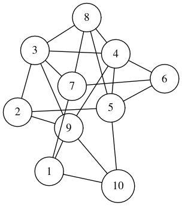
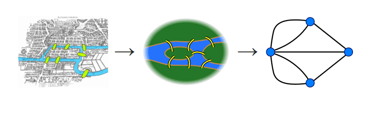

# Introducción a los grafos

Un **grafo** es una estructura matemática que modela un conjunto de objetos (llamados **vértices** o **nodos**) y las conexiones entre ellos (llamadas **aristas** o **arcos**).



Algunas **aplicaciones clásicas** de los grafos incluyen:

- Detectar partes de una red que estén desconectadas.
- Encontrar **caminos más cortos** en mapas (por ejemplo, rutas GPS).
- Resolver problemas clásicos como los **puentes de Königsberg**, el cual motivó la teoría de grafos cuando Euler intentó determinar si era posible cruzar todos los puentes de una ciudad sin cruzar el mismo puente dos veces.



## Conceptos basicos


- ### Camino

  Un **camino** en un grafo es una secuencia de vértices \( v_0, v_1, \ldots, v_k \) tal que para cada \( i \), existe una arista que conecta \( v_i \) con \( v_{i+1} \). Un camino puede **repetir vértices o aristas**, pero muchas veces nos interesan caminos **simples**, donde no se repite ningún vértice.

- ### Ciclo

  Un **ciclo** es un camino que empieza y termina en el mismo vértice, y donde no se repiten vértices ni aristas (excepto el primero y el último vértice, que es el mismo). Por ejemplo, en un triángulo los tres vértices forman un ciclo.

- ### Grafo dirigido y no dirigido

  - Un **grafo dirigido** (o **dígrafo**) es aquel en el que las aristas tienen dirección: de un nodo hacia otro. Es decir, una arista de \( u \) a \( v \) no implica necesariamente una arista de \( v \) a \( u \).

  - Un **grafo no dirigido** es aquel en el que las aristas **no** tienen dirección: la conexión entre dos nodos va en ambos sentidos.

- ### Distancia

  La **distancia** entre dos nodos es el número mínimo de aristas necesarias para ir de uno a otro, es decir, la longitud del camino más corto entre ellos. Si no existe ningún camino, se dice que la distancia es infinita o no está definida.

- ### Componente conexa

  En un **grafo no dirigido**, una **componente conexa** es un subconjunto de vértices tal que: cualquier par de vértices en este subconjunto está conectado por algún camino, y no hay ningún vértice fuera del subconjunto que esté conectado con alguno de sus vértices. En palabras simples, es una "isla" de nodos todos interconectados entre sí, pero desconectados del resto del grafo.

- ### Subgrafo

  Un **subgrafo** de un grafo es un grafo que tiene un subconjunto de vértices y aristas del grafo original. Es decir, es un grafo que es parte de otro grafo.

- ### Árbol

- Un **árbol** es un tipo especial de grafo, que es **conexo** y **sin ciclos**. Eso significa que:

  - Todos los nodos están conectados entre sí por caminos (no hay nodos aislados).
  - No hay forma de empezar en un nodo, seguir una secuencia de aristas, y volver al mismo nodo **sin repetir aristas o nodos**, salvo el punto de partida (es decir, no hay ciclos).

  Un árbol con \( n \) nodos siempre tiene exactamente \( n-1 \) aristas.

- ### Árbol recubridor

  Un **árbol recubridor** de un grafo es un subgrafo que incluye todos los nodos del grafo original, y es un árbol.

## Representación: listas de adyacencia

Una de las formas más eficientes de representar grafos, especialmente si son ralos (pocas aristas comparado con el total de pares posibles de nodos), es la **lista de adyacencia**.

En C++, se suele declarar así:

```cpp
int n; // cantidad de nodos (los nodos se numeran de 0 a n-1)
vector<int> g[maxn]; // g[u] contiene la lista de vecinos de u
// o bien, vector<vector<int>> g(n);
```

Por ejemplo, para agregar una arista dirigida de \( u \) a \( v \):

```cpp
adj[u].push_back(v);
```

Si el grafo es **no dirigido**, se agrega la arista en ambos sentidos:

```cpp
adj[u].push_back(v);
adj[v].push_back(u);
```

## Recorridos con bolsas

En programación siempre nos interesan formas de recorrer cada elemento de una
estructura de datos. Esto no cambia a la hora de trabajar con grafos. Si bien,
gracias a su generalidad, son mas complicados que otras estructuras, existe una
forma simple para recorrer un grafo:

Tomar un nodo, y agregar todos sus vecinos a una estructura de datos.

Mientras la estructura de datos no esté vacía, tomar un nodo de la estructura, quitarlo, y agregar todos sus vecinos que aun no han sido visitados a la estructura.

Esto eventualmente visitara toda la componente conexa que contiene al nodo inicial.

Resulta que podemos lograr distintos efectos cambiando la estructura de datos que usamos.

### DFS (Depth-First Search) iterativo

El **DFS** explora lo más profundo posible antes de retroceder. En su versión iterativa, se usa una pila (stack):

```cpp
vector<bool> visitado(n, false);
stack<int> S;
S.push(s); // s es el nodo de partida
while (!S.empty()) {
    int u = S.top(); S.pop();
    if (visitado[u]) continue;
    visitado[u] = true;

    // procesar el nodo u aquí

    for (int v : adj[u])
        S.push(v);
}
```

### BFS (Breadth-First Search) iterativo

El **BFS** recorre el grafo por capas, primero visitando todos los vecinos inmediatos antes de avanzar. Para esto, se usa una cola (queue):

```cpp
vector<bool> visitado(n, false);
queue<int> Q;
Q.push(s);
while (!Q.empty()) {
    int u = Q.front(); Q.pop();
    if (visitado[u]) continue;
    visitado[u] = true;

    // procesar el nodo u aquí

    for (int v : adj[u])
        Q.push(v);
}
```

## DFS recursivo

En el DFS muchas veces queremos hacer algun procesamiento no solo antes de recorrer los vecinos, sino tambien despues de recorrerlos, o cuando recorremos una arista. Con un codigo mas complicado podemos lograrlo iterativamente, pero es mas simple hacerlo recursivamente.

```cpp
vector<bool> visitado(n, false);

void dfs(int u) {
    visitado[u] = true;

    // procesar el nodo u aquí

    for (int v : adj[u]) {
        if (!visitado[v]) {
            // procesar la arista (u, v) aquí
            dfs(v);
        }
    }

    // procesar el nodo u aquí después de recorrer los vecinos
}
```

Estos recorridos son la base para muchísimos algoritmos sobre grafos, como encontrar componentes conexas, detectar ciclos, calcular caminos mínimos y mucho más.

## Distancias y caminos mínimos

La distancia entre dos nodos en un grafo es el número mínimo de aristas necesarias para ir de uno a otro.

Para calcular la distancia entre dos nodos, podemos usar el BFS. En particular, al insertar un nodo en la cola, podemos calcular la distancia a la que se encuentra del nodo inicial. También podemos guardar el nodo anterior en el que se encontraba para reconstruir el camino.

```cpp
vector<int> dist(n, -1);
vector<int> prev(n, -1);
queue<int> Q;
Q.push(s);
dist[s] = 0;
while (!Q.empty()) {
    int u = Q.front(); Q.pop();
    if (visitado[u]) continue;
    visitado[u] = true;

    for (int v : adj[u]) {
        if (dist[v] == -1) {
            dist[v] = dist[u] + 1;
            prev[v] = u;
            Q.push(v);
        }
    }
}
```

Después, para reconstruir el camino (s, t), podemos usar el vector `prev`.

```cpp
vector<int> path;
int u = t; // t es el nodo final
while (u != -1) {
    path.push_back(u);
    u = prev[u];
}
reverse(begin(path), end(path));
```

## Grafos implicitos

Muchas veces, en vez de construir el grafo que nos da el problema, es más cómodo o más eficiente modificar los algoritmos para que funcionen con representaciones "raras" del grafo.

Ya hablamos esto en la sección de grafos de estados.

Otro ejemplo común es en problemas que son sobre una grilla. En esos, en vez de construir los nodos y aristas, podemos recorrer la grilla directamente, construyendo las aristas en el momento que las necesitamos.

La ventaja sería que usamos menos memoria, y menos tiempo para construir el grafo.

Si lo hacemos bien, no nos ocupa más código que si construimos el grafo explicitamente.

```cpp
using cell = pair<int,int>;
cell offsets[] = {{-1, 0}, {1, 0}, {0, -1}, {0, 1}};

inplace_vector<cell, 4> adj(cell u) {
    inplace_vector<cell, 4> ans;
    auto [u1, u2] = u;
    for (auto [d1, d2] : offsets) {
        int v1 = u1 + d1, v2 = u2 + d2;
        if (v1 < 0 || v1 >= n || v2 < 0 || v2 >= m) continue;
        ans.push_back({v1, v2});
    }
    return ans;
}

// despues en el recorrido:
for (cell v : adj(u)) { // notar que usamos parentesis en vez de corchetes para obtener los vecinos
    Q.push(v);
}
```

Este codigo usa [`inplace_vector`](https://en.cppreference.com/w/cpp/container/inplace_vector.html), que es como vector pero con un tamaño máximo predeterminado, y no reserva memoria dinámica.

Desafortunadamente `inplace_vector` es parte de C++26, y (por ahora) no está disponible en la mayoria de jueces online.

Si siempre tenemos **exactamente** 4 vecinos, podemos usar un `array<cell, 4>` en vez de `inplace_vector`.

En cambio, si, como en este caso, podemos tener menos de 4 vecinos, tenemos que hacerlo mucho mas manualmente (o usar vector, pero es mucho mas lento).

```cpp
for (auto [d1, d2] : offsets) {
    auto [u1, u2] = u;
    int v1 = u1 + d1, v2 = u2 + d2;
    if (v1 < 0 || v1 >= n || v2 < 0 || v2 >= m) continue;
    Q.push({v1, v2});
}
```

> Otra idea es aprovechar el small string optimization de `std::basic_string`, pero nos podemos llevar sorpresas porque el tope de tamaño puede ser distinto en distintos jueces.

## Grafos de estados

En muchos problemas, el grafo que representa el problema es casi obvio.

Por ejemplo, si nos plantean que un pais hay N ciudades, y hay M carreteras entre ellas, y queremos saber la distancia minima entre dos ciudades, queda claro que hay un grafo donde las ciudades son los nodos y las carreteras son las aristas.

Pero en otros problemas, se complican las cosas. Muchas veces nos hacen preguntas sobre procesos que se realizan caminando el grafo, que mantienen un estado.

Por ejemplo, consideremos que algunas de las carreteras son peligrosas, y queremos la distancia minima entre dos ciudades, pasando por a lo sumo K carreteras peligrosas.

En ese caso, un nodo puede representarse como (U, C), con el significado "estoy en la ciudad U y he pasado por C carreteras peligrosas".

### Implementaciones

La implementación "expicita" de esto es construir un grafo con N*(K+1) nodos, separados en K+1 "capas", donde las aristas peligrosas cruzan de una capa a la siguiente.

Para hacer esto es necesario definir una correspondencia entre estados (u,c) e indices de nodos en el grafo.

```cpp
int idx(int u, int c) { return c*n + u; }
```

Despues al construir el grafo, insertamos una copia de cada arista en cada capa.

```cpp
vector<vector<int>> g(n*(k+1));
for (int i = 0; i < m; ++i) {
    int u, v, w;
    cin >> u >> v >> w;
    --u; --v;
    if (w == 0) { // arista segura
        for (int c = 0; c <= k; ++c) {
            g[idx(u, c)].push_back(idx(v, c));
            g[idx(v, c)].push_back(idx(u, c));
        }
    } else { // arista peligrosa
        for (int c = 0; c < k; ++c) {
            g[idx(u, c)].push_back(idx(v, c+1));
            g[idx(v, c)].push_back(idx(u, c+1));
        }
    }
}
```

Lo conveniente de esta implementación es que nos queda un grafo dirigido común y corriente, y podemos usar el código típico de BFS para encontrar la distancia minima entre dos nodos.

La desventaja es que el grafo ocupa mucha memoria, y por lo tanto es más costoso de inicializar y recorrer.

La implementación "implicita" es crear el grafo de N nodos, con cada arista etiquetada con si es segura o peligrosa, pero modificar el BFS para que pueda trabajar con varias distancias para cada nodo.

```cpp
vector<vector<pair<int, bool>>> g(n);
for (int i = 0; i < m; ++i) {
    int u, v, w;
    cin >> u >> v >> w;
    --u; --v;
    g[u].push_back({v, w != 0});
    g[v].push_back({u, w != 0});
}

// falta implementar las distancias, se omitió por claridad
vector<vector<bool>> visitado(n, vector<bool>(k+1, false));
queue<pair<int, int>> Q;
Q.push({s, 0});
while (!Q.empty()) {
    auto [u, c] = Q.front(); Q.pop();
    if (visitado[u][c]) continue;
    visitado[u][c] = true;
    for (auto [v, peligro] : g[u]) {
        Q.push({v, c + int(peligro)});
    }
}
```

Acá la desventaja es tener que modificar el código de una forma espécifica para el problema. Esto no es tan grave para BFS, pero con algoritmos mas complejos (e.g. Dinitz para max flow) puede ser un problema.


### BFS multisource

En algunos problemas, tenemos que hacer la busqueda de camino mínimo desde varios nodos iniciales. O sea, se quiere saber para cada nodo, la distancia al mas cercano de algunos nodos especiales.

Para esto, podemos usar un BFS multisource. No es mas que un BFS normal, pero con varios nodos iniciales.

```cpp
queue<int> Q;
for (int s : sources) Q.push(s);
while (!Q.empty()) {
    // codigo del BFS normal
}
```

### Super fuente

Otra forma de hacer lo anterior es crear un nodo inicial artificial que tenga aristas a todos los nodos iniciales, y hacer un BFS desde ese nodo.

De nuevo, el truco del BFS multisource es fácil, pero modificar el código de otros algoritmos se puede complicar (Dinitz).

También hay algoritmos que tienen esta idea de "super fuente" como base, como el algoritmo de Johnson para caminos minimos en grafos con pesos negativos.

### Invertir las aristas

Hay veces que nos interesa saber cosas sobre "quien puede llegar a este nodo" en vez de "a donde se puede llegar desde este nodo", y en esos casos es muy util invertir las aristas.

Por ejemplo, en [ICPC Latin America Regional Contest 2023 - Problema A](https://codeforces.com/group/8JufKtWW7p/contest/104252/problem/A).

Otra aplicación, mas como truco de implementación, es en problemas de camino mínimo. Invertir las aristas hace que no tengamos que dar vuelta el camino al final.


## Problemas

- <https://cses.fi/problemset/task/1666>
- <https://cses.fi/problemset/task/1193>
- <https://cses.fi/problemset/task/1668>
- <https://cses.fi/problemset/task/1194>
- <https://codeforces.com/group/8JufKtWW7p/contest/104252/problem/A> - (A del Latam 2023)

## Enlaces

- <https://codeforces.com/blog/entry/45897>