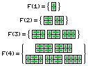
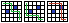
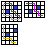

## Programación dinámica.

Programación dinámica es uno de los temas más comunes en competencias de programación.

Técnicamente, es un método para resolver problemas de optimización pero, como todas las ideas más importantes se pueden aplicar también a problemas de conteo, en programación competitiva englobamos todos los problemas que usan estas ideas bajo el nombre de "programación dinámica" o DP (de Dynamic Programming).

>  Una pregunta interesante es: «¿De dónde salió el nombre “programación dinámica”?»
>
> Los años cincuenta no fueron buenos para la investigación matemática. Teníamos en Washington a un caballero muy interesante llamado Wilson. Era Secretario de Defensa y, de hecho, tenía un miedo y un odio patológico a la palabra «investigación». ... Su rostro se congestionaba, se ponía rojo y se volvía violento si la gente usaba el término investigación en su presencia. Puedes imaginar, entonces, lo que sentía por el término matemático.
>
> Por lo tanto, sentí que tenía que hacer algo para proteger a Wilson y a la Fuerza Aérea del hecho de que realmente estaba haciendo matemáticas
>
> En primer lugar, me interesaban la planificación, la toma de decisiones, el pensamiento. Pero planificación no es una buena palabra por varias razones. Decidí, por lo tanto, usar la palabra «programación». Aparte, quería transmitir la idea de que esto era dinámico, que era multietapa, que variaba en el tiempo. La palabra «dinámico» tiene una propiedad muy interesante como adjetivo, y es que es imposible usarla en un sentido peyorativo.
>
>Intentá pensar en alguna combinación que pueda darle un significado peyorativo. Es imposible. Así que pensé que programación dinámica era un buen nombre.
>
> — Richard Bellman, creador de la programación dinámica

## Conteo de conjuntos inductivos

Cuando tenemos una familia de conjuntos, muchas veces podemos calcular el tamaño de un conjunto en términos de los tamaños de otros conjuntos de la familia.

Por ejemplo, imaginate un tablero de `2`x`N` casillas. ¿De cuántas formas lo podemos tapar con fichas de Dominó?

Consideremos el conjunto de formas `F(N)`. Si `N=1`obviamente hay una sola forma. Si `N=2`, hay dos formas.



Si `N>2`, entonces podemos pensar lo siguiente:

Si ponemos una fichita vertical a la izquierda de todo, nos queda un hueco de `2 x (N-1)` y ahi podemos completar con cualquiera de las formas del conjunto `F(N-1)`.

Si ponemos fichitas horizontales a la izquierda de todo, nos queda un hueco de `2 x (N-2)`, que podemos rellenar con cualquiera de las formas de `F(N-2)`.

2" src="img/domino-caso-general.png" style="image-rendering: pixelated; width: 396px">

Estos dos casos son mutuamente excluyentes. Entonces, por el principio de la suma, el tamaño del conjunto es `#F(N) = #F(N-1) + #F(N-2)`.

Para calcular estos valores, podemos definir un arreglo `F` tal que `F[i] = #F(i)`.

```cpp
int dominos(int N) {
    vector<int> F(N+1);
    F[1] = 1;
    F[2] = 2;
    forr(i, 3, N+1) F[i] = F[i-1] + F[i-2];
    return F[N];
}
```

Para este problema sencillo, es facil pasar de la idea a la implementación, pero hay varios pasos que estamos dando por sentado, y que en otros problemas se pueden complicar.

Veamos otros problemas para entender bien cuáles son esos pasos, y algunas técnicas alternativas.

## Relación de recurrencia

Hay que entender la forma del problema, y encontrar la forma de calcular la solución al problema usando la solución de "subproblemas". O sea, a ver si podemos calcular la cantidad de otra cosa del mismo estilo y hacer una cuenta para calcular la cantidad original.

### Problema: Caminos de grilla

Imaginate una grilla de NxM, y queremos contar la cantidad de caminos de la **casilla** de la esquina superior izquierda a la **casilla** inferior derecha, moviendose solo hacia abajo o hacia la derecha.

Vimos la semana pasada que la respuesta es `(N+M-2 choose N-1)` (Porque hay que dar `N-1` pasos hacia abajo y `M-1` pasos hacia la derecha).

Ahora queremos agregar obstaculos a la grilla.



¿De cuántas formas se puede hacer esto?

Imaginate el conjunto de caminos que llegan a (N-1,M-1). Hay algunos de ellos que llegan desde la izquierda (de la casilla (N-1,M-2)), y otros que llegan desde arriba (casilla (N-2,M-1)). Si logramos contar la cantidad de caminos que terminan en cada una de esas casillas, podemos sumar para obtener la respuesta (principio de la suma).

Notemos que:

- la cantidad de caminos que llegan a (N-1,M-2) es la respuesta al mismo problema, pero sobre una grilla de tamaño `(N)x(M-1)`.
- la cantidad de caminos que llegan a (N-2,M-1) es la respuesta al mismo problema, pero sobre una grilla de tamaño `(N-1)x(M)`.



A esto nos referimos con "subproblemas": reducimos el problema de contar caminos en una grilla de tamaño `(N)x(M)` a contar caminos en grillas de tamaño `(N)x(M-1)` y `(N-1)x(M)`. Estos dos son problemas del mismo estilo, y son "más chicos" que el original.

Si definimos el conjunto:

`C(i, j) = { caminos en una grilla de tamaño (i)x(j) sin pasar por obstaculos }`

Y observamos que:

- si no hay obstaculo en la casilla (i-1,j-1), entonces `#C(i, j) = #C(i-1, j) + #C(i, j-1)`.
- si hay obstaculo en la casilla (i-1,j-1), entonces `#C(i, j) = 0`.

Si aparte manejamos el caso de las grillas de tamaño 1xM y Nx1 (solo podemos reducir en una dimension), tenemos la relación de recurrencia completa, que podemos implementar con un bucle:

```cpp
int caminos(vector<vector<bool>> obstaculo) {
    int N = obstaculo.size();
    int M = obstaculo[0].size();
    vector<vector<int>> C(N+1, vector<int>(M+1));
    forr(i, 1, N+1) forr(j, 1, M+1) {
        if (obstaculo[i-1][j-1]) {
            C[i][j] = 0;
        } else if (i == 1 && j == 1) {
            C[i][j] = 1;
        } else if (i == 1) {
            C[i][j] = C[i][j-1];
        } else if (j == 1) {
            C[i][j] = C[i-1][j];
        } else {
            C[i][j] = C[i-1][j] + C[i][j-1];
        }
    }
    return C[N][M];
}
```

### Conjunto de estados

A los posibles subproblemas que podemos definir, los llamamos "estados".

En el problema anterior, el estado son las subgrillas de tamaño `(i)x(j)` que en nuestro programa representamos con el par de enteros `(i, j)`.

Igual que en problemas de grafos donde el conjunto de nodos son "cosas raras", acá el conjunto de estados puede ser bastante raro.

### Problema: Subsecuencias

Dada una string, contar subsequencias que no contienen la substring "2001" (mi año de nacimiento :p).

> Para una versión moderadamente más difícil, cambiar la substring prohibida a "2026"
>
> Para un desafío final, usar una string arbitraria `S`, dada también como input.

Estados:

`S(i,j) = { subsequencias de S[i..N] que no contienen la substring "2001"[j..4]}`

O sea, j es como un offset para la substring "2001" que nos interesa.

La idea es que representa una cantidad de caracteres de "2001" que acaban de aparecer en la subsequencia.

Si en algun momento llega a 4, entonces la subsequencia contiene la substring "2001" y no es valida (devolvemos 0)

> Esto se complica con "2026" porque al encontrar "202" no sabemos si nos vamos a encontrar con un "6" o con un "026", que ambas cosas estarían prohibidas.
>
> En el caso general de una string arbitraria, se complica aún más porque esto mismo puede pasar varias veces en la misma cadena prohibida.

Bueno el conjunto de estados es medio raro. Es como que nos podemos imaginar un algoritmo que va buscando la string "2001" y los estados de la DP se corresponden con el estado del algoritmo.

TODO: implementar

## Orden de dependencias

Si encontramos la forma de calcular un resultado a partir de resultados de subproblemas, esto no nos resuelve del todo el tema.

Para poder calcular un valor particular tenemos que primero calcular todos los valores de los que depende. Para estos, necesitamos sus dependencias, y asi sucesivamente.

En los problemas que vimos hasta ahora siempre tuvimos suerte y el bucle más obvio siempre cumplia con las dependencias pero:

- Si las dependencias "van y vienen" y un valor depende de si mismo, entonces no vamos a poder calcularlo
- Si el problema no tiene forma de tabla es complicado escribir un for que recorre los estados en un orden bueno

En particular, tenemos que elegir un orden para calcular los valores, que respete las dependencias.

Imaginate un grafo que los nodos son los estados y las aristas son dependencias. Tenemos que encontrar un orden de los nodos tal que cada arista apunte a un nodo anterior. Esto se llama un "orden topológico".

### Construir el orden dinámicamente

Si es muy dificil encontrar un orden para recorrer los estados, podemos generarlo dinámicamente.

Una primera idea es armar el grafo de dependencias y encontrar un orden topológico. Se puede hacer por ejemplo con un DFS, pero implementativamente es muy molesto y hay que manejar mapeos entre los nodos del grafo y los estados del problema.

La alternativa es escribir la relación de recurrencia con una función recursiva.

El estado se ve representado en los argumentos de la función.

Las dependencias se ven en las llamadas recursivas.

O sea, si tenemos una función `f(n)` que calcula el resultado para el estado `n`, y las dependencias son `f(n-1)` y `f(n-2)`, entonces podemos escribir:

```cpp
int f(int n) {
    if (n == 1) return 1;
    if (n == 2) return 2;
    return f(n-1) + f(n-2);
}
```

Notar que este codigo tiene costo exponencial, asique hacemos un truco: memoizar los resultados.

Simplemente agregamos una tabla donde guardamos el resultado de cada estado. En la función solo calculamos el resultado si no está en la tabla.


```cpp
int memo[maxn+1];
void init() {
    forn(i, maxn+1) memo[i] = -1;
}

int domino(int n) {
    if (memo[n] != -1) return memo[n];
    if (n == 1) return memo[n] = 1;
    if (n == 2) return memo[n] = 2;
    return memo[n] = domino(n-1) + domino(n-2);
}
```

Para este problema con una recurrencia tan simple, es medio overkill, pero es muy util cuando la relación de recurrencia es mas complicada.

### Problema: Caminos Hamiltonianos

Subproblemas:

```
H(u, S) = { caminos Hamiltonianos que empiezan en u y visitan todos los vertices en S exactamente una vez }
```

---------------


Problemas de ejemplo ilustrativos.

- Contar caminos en grilla de NxM, moviendose solo hacia abajo o hacia la derecha, con obstaculos en la grilla.
- Dada una string, contar subsequencias que:
  - Version facil: no contienen la substring "2016"
  - Version intermedia: no contienen la substring "2026"
  - version dificil: no contienen una string arbitraria S, dada también como input.
- Cantidad de caminos Hamiltonianos en un grafo